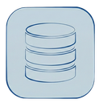

  

<h1 align="center">VSTable</h1>

  <a href="docs/README_CN.md">简体中文</a>
   
  A modern, fast, and cross-platform database management tool built for speed and productivity.

---

VSTable provides a clean, intuitive interface heavily inspired by modern code editors VSCode, offering a seamless and productive experience for interacting with your databases. It natively supports **MySQL** and **PostgreSQL**.

## Core Features

### Modern Data Grid
Experience fast, responsive data viewing. The grid comes with built-in pagination, sorting, and an intuitive layout that makes browsing large datasets effortless.

### Smart Filtering
Quickly find the data you need. Use the intelligent filtering bar located directly above the grid to build conditions using intuitive dropdowns and input fields—no SQL required.

### Visual Table Editor
Easily view, create, and modify table structures. Add or edit columns, configure data types, manage constraints, and handle indexes through a clean visual interface instead of writing raw DDL.

### Native SQL Execution
When you need full control, write and run custom SQL queries in a dedicated editor and view the results instantly.

### Quick Navigation & Tabs (IDE-like Experience)
Navigate your databases at the speed of thought.

## Keyboard Shortcuts

VSTable is designed to be keyboard-first, offering familiar shortcuts for common actions:

| Shortcut | Action |
| --- | --- |
| **`Cmd/Ctrl + P`** | **Quick Search** - Instantly find and open tables |
| **`Ctrl + Tab`** | **Cycle Tabs** - Switch between open views |
| **`Cmd/Ctrl + T`** | **New Query** - Open a new SQL editor tab |
| **`Cmd/Ctrl + W`** | **Close Tab** - Close the current active tab |
| **`Cmd/Ctrl + R`** | **Refresh** - Reload data or table structure |
| **`Cmd/Ctrl + F`** | **Focus Filter** - Jump straight to the search/filter bar |
| **`Cmd/Ctrl + Enter`** | **Run Query** - Execute SQL (when in Query Editor) |

## Installation

VSTable is available as a standalone desktop application for macOS and Windows.

1. **Download**: Go to the [Releases](https://github.com/rust17/vstable/releases) page.
2. **Choose your version**:
   - **macOS**: Download the `.dmg` or `.zip` file.
   - **Windows**: Download the `.exe` installer.
3. **Install**: Open the downloaded file and follow the standard installation process for your platform.

## License

This project is licensed under the MIT License - see the [LICENSE](LICENSE) file for details.

## Contributing

Contributions are welcome! Please check the issues or submit pull requests.
