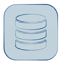
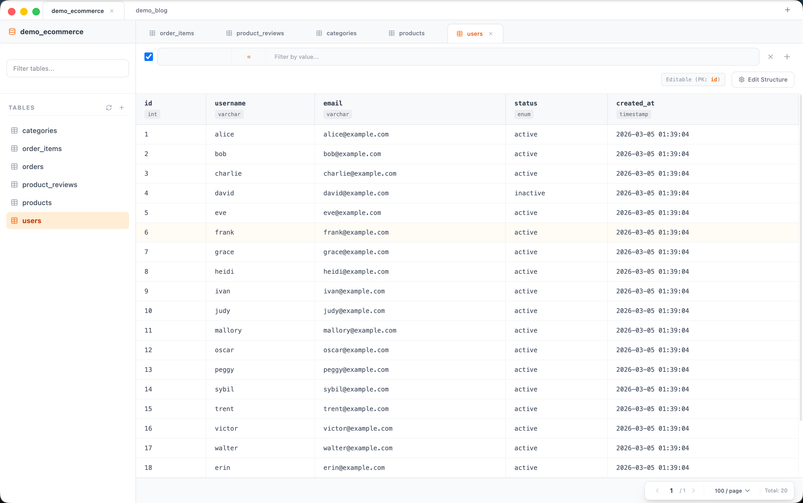
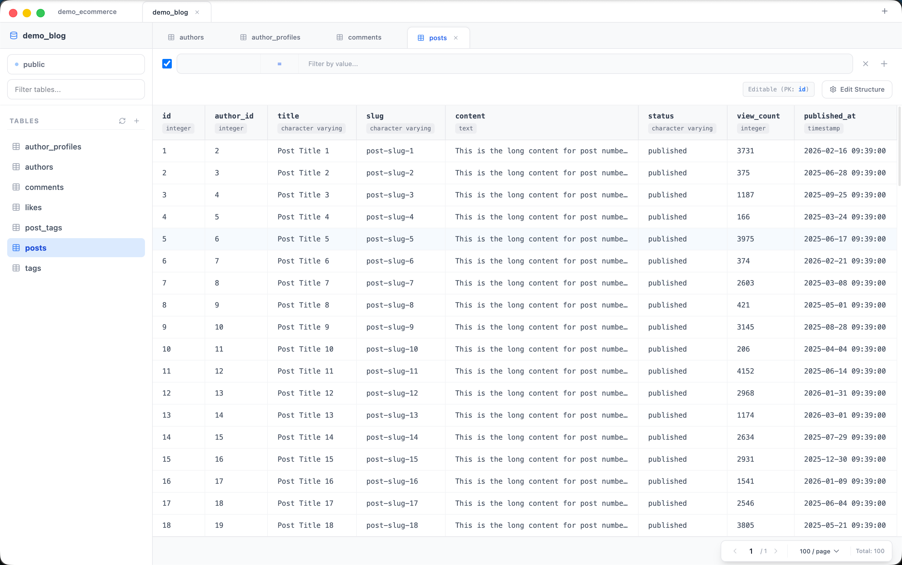
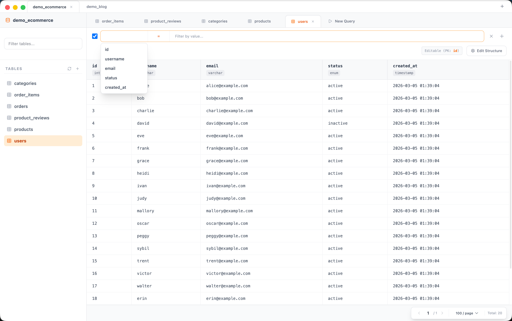
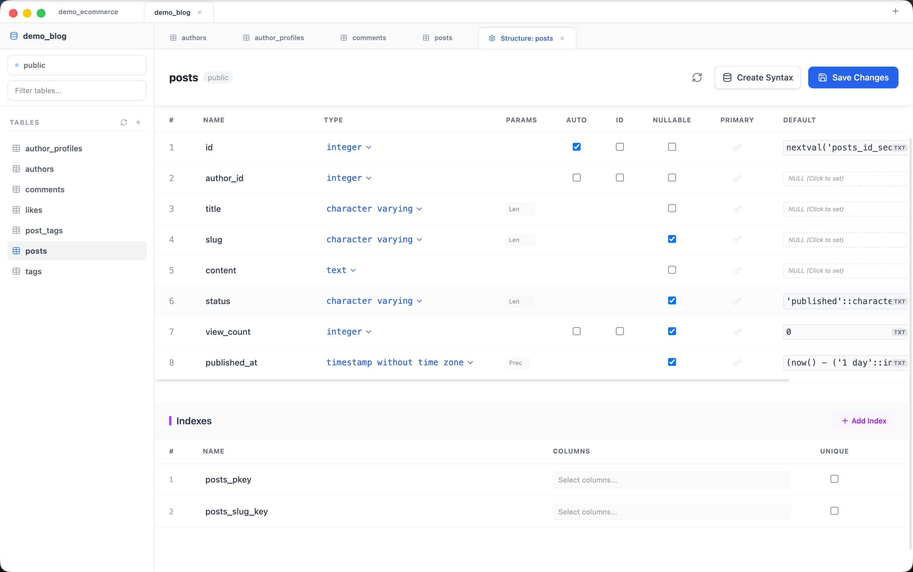
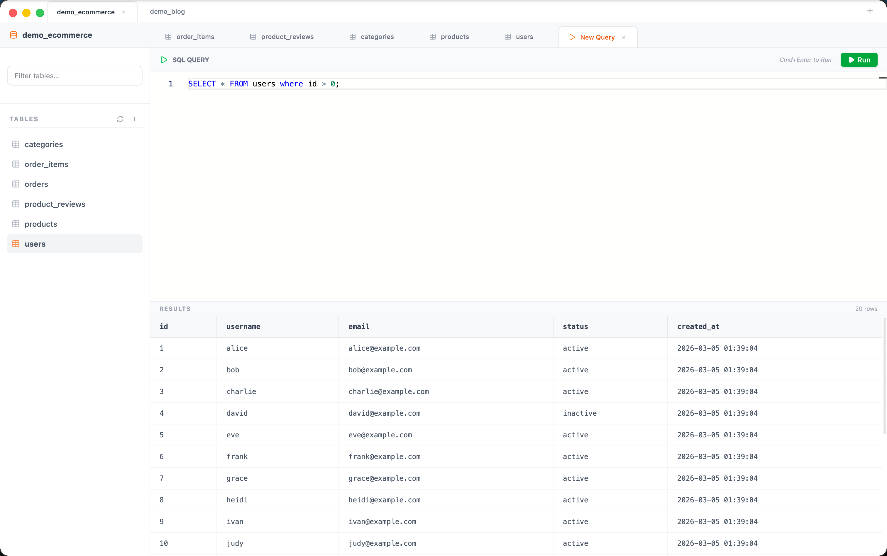
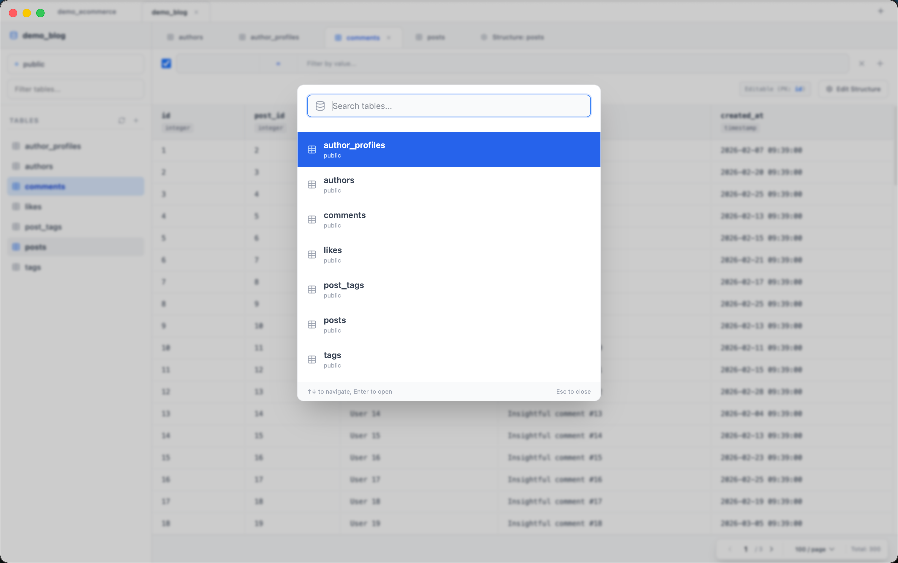
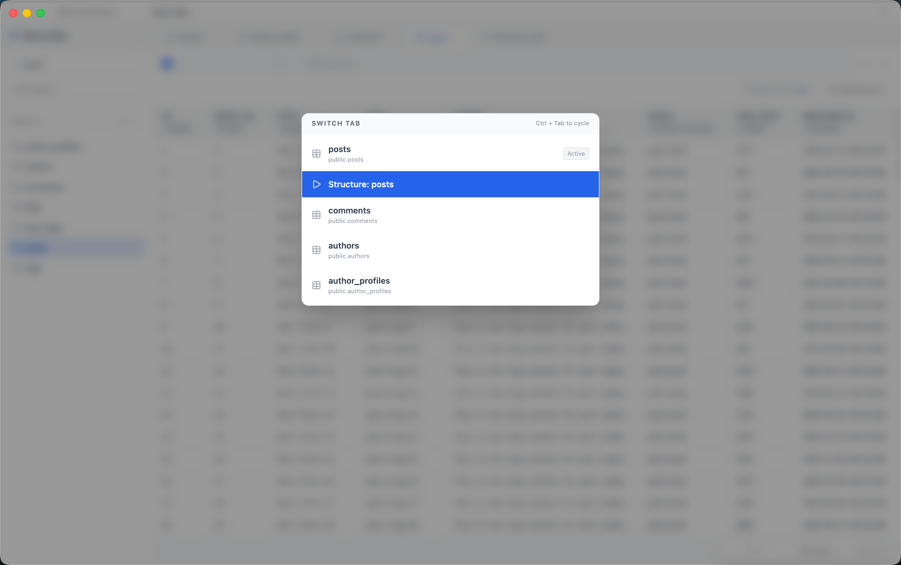

  

<h1 align="center">VSTable</h1>

  一款为速度和效率而生的现代化、快速、跨平台数据库管理工具。

---

VSTable 提供了一个简洁直观的界面，深受现代化代码编辑器 VSCode 的启发，为您与数据库的交互提供无缝且高效的体验。它原生支持 **MySQL** 和 **PostgreSQL**。

## 核心特性

### 现代化数据网格
体验快速、响应式的数据查看。网格内置了分页、排序功能，其直观的布局让浏览大数据集变得轻而易举。

### 智能过滤
快速找到所需数据。使用网格正上方的智能过滤栏，通过直观的下拉菜单和输入框构建条件——无需编写 SQL。

### 可视化表编辑器
轻松查看、创建和修改表结构。通过简洁的可视化界面添加或编辑列、配置数据类型、管理约束和处理索引，无需手动编写复杂的 DDL。

### 原生 SQL 执行
当您需要完全掌控时，可以在专用编辑器中编写并运行自定义 SQL 查询，并立即查看结果。

### 快速导航与标签页（类 IDE 体验）
以思维的速度在数据库中导航。

## 快捷键支持

VSTable 专为键盘优先设计，为您常用的操作提供熟悉的快捷键：

| 快捷键 | 动作 |
| --- | --- |
| **`Cmd/Ctrl + P`** | **快速搜索** - 立即查找并打开表 |
| **`Ctrl + Tab`** | **循环标签页** - 在打开的视图间切换 |
| **`Cmd/Ctrl + T`** | **新建查询** - 打开一个新的 SQL 编辑器 |
| **`Cmd/Ctrl + W`** | **关闭标签页** - 关闭当前活动标签页 |
| **`Cmd/Ctrl + R`** | **刷新** - 重新加载数据或表结构 |
| **`Cmd/Ctrl + F`** | **聚焦过滤** - 直接跳转到搜索/过滤栏 |
| **`Cmd/Ctrl + Enter`** | **执行查询** - 运行 SQL（在查询编辑器中） |

## 安装指南

VSTable 作为独立的桌面应用程序，支持 macOS 和 Windows。

1. **下载**：访问 [Releases](https://github.com/rust17/vstable/releases) 页面。
2. **选择版本**：
   - **macOS**：下载 `.dmg` 或 `.zip` 文件。
   - **Windows**：下载 `.exe` 安装程序。
3. **安装**：打开下载的文件，按照平台的标准安装流程进行操作。

## 开源协议

本项目基于 MIT 协议开源 - 详情请参阅 [LICENSE](../LICENSE) 文件。

## 参与贡献

欢迎参与贡献！请查看 Issue 或提交 Pull Request。
